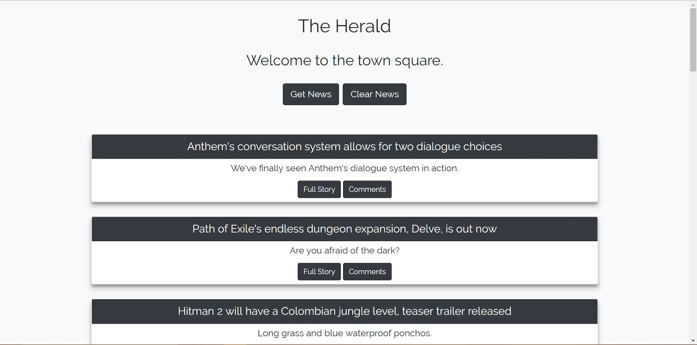
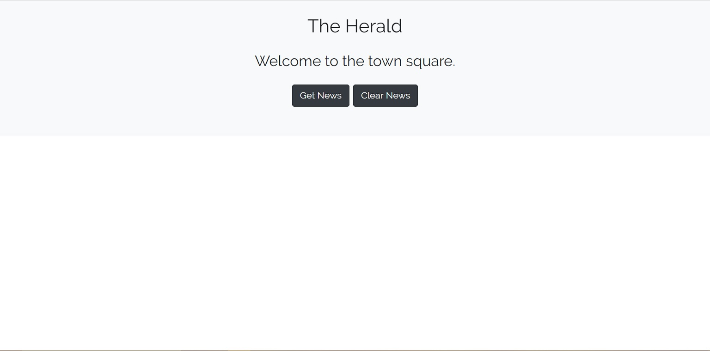
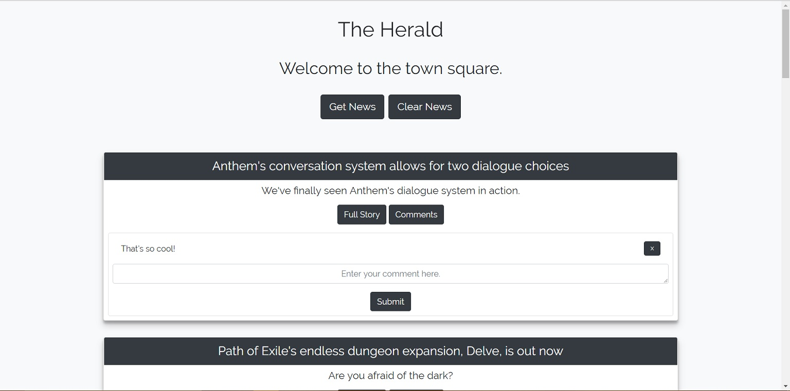

# town-herald

## Description

A simple full-stack app which allows users to scrape and comment on news articles from PC Gamer. It was developed to practice and demonstrate my skills with an emphasis on MongoDB, Mongoose ODM, and Cheerio web scraping.

## Walkthrough

Upon starting the app for the first time, press the "Get News" button to populate the app with current articles. This button can be pressed again to grab more articles at any time.

To clear articles that are already populated in the app, press the "Clear News" button.

If an article sparks your interest, press the "Full Story" button to be redirected to the article on PC Gamer.

Pressing a "Comments" button will expand the respective article to show an area for viewing and entering comments. Comments can also be individually deleted by pressing the adjacent "X" button.

## Contribution and Help

Morrowii is the sole person maintaining and contributing to this project.

If you need help with anything related to this project, drop me a line on GitHub.

## Live Demo

The deployed app can be viewed here: https://town-herald.herokuapp.com/